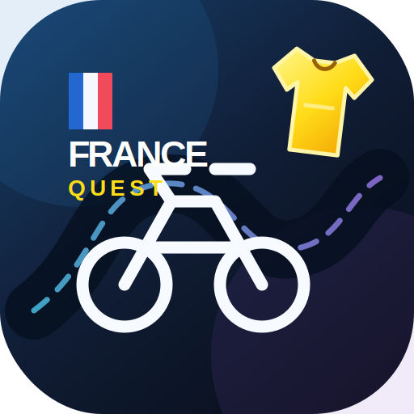

<div align="center">
  

  # France Quest

  **Eine spielerische Tour de France durch die französische Sprache.**  
  Reise-Französisch auf Niveau A2/B1 · mobil · offlinefähig · ohne Anmeldung

  
  
  
  
</div>

## Über die App

France Quest verwandelt Reise-Französisch in eine virtuelle Radrundfahrt. Jede französische Stadt ist eine Etappe mit eigener Landschaft, Farbwelt und einem typischen Gesprächsthema. Die Reise beginnt in Strasbourg und endet mit dem Grand Final in Paris.

Die App läuft direkt im Browser, benötigt keinen Build-Schritt und speichert den Lernfortschritt ausschließlich lokal auf dem Gerät.

## Das bietet France Quest

- 12 thematische Reiseetappen von Strasbourg bis Paris
- 168 Vokabeln mit Beispielsätzen
- 84 Scaffolds als Gerüste für eigene Gesprächsbeiträge
- 24 französische Lückensätze
- 12 dreistufige Conversation Challenges
- Aufgaben von Deutsch nach Französisch und Französisch nach Deutsch
- Multiple Choice, Lückentext und vollständig getippte Antworten
- 8 Grammatikpässe zu zentralen A2/B1-Themen
- freier Übe-Modus für einzelne Städte oder die gesamte Tour
- XP, Herzen, Lernserie, Münzen, Konfetti und Etappen-Abzeichen
- wechselnde dunkle Landschaften passend zur jeweiligen Region
- installierbar und offlinefähig als Progressive Web App

## Die Route

| Etappe | Stadt | Gesprächsthema | Kulisse |
|---:|---|---|---|
| 1 | Strasbourg | Begrüßen und Small Talk | Altstadt am Rhein |
| 2 | Colmar | Anreise und Gepäck | Weinberge im Elsass |
| 3 | Annecy | Orientierung und Nahverkehr | Alpen und Bergsee |
| 4 | Lyon | Unterkunft und Reservieren | Großstadt an der Rhône |
| 5 | Avignon | Restaurant und Café | Provence |
| 6 | Marseille | Apotheke und Gesundheit | Mittelmeerküste |
| 7 | Nice | Wetter und Freizeitpläne | Riviera |
| 8 | Toulouse | Markt und Einkaufen | Südfranzösische Stadt |
| 9 | Bordeaux | Fußball und Small Talk | Weinland an der Garonne |
| 10 | Nantes | Probleme und Notfälle | Atlantik und Loire |
| 11 | Lille | Einladung, Kultur und Abschied | Nordfranzösische Stadtkulisse |
| 12 | Paris | gemischtes Grand Final | Lichter der Hauptstadt |

Jede Etappe führt in drei Mini-Étapes neue Wörter und Gesprächsgerüste ein. Danach folgt die Conversation Challenge in fester Lernprogression:

1. passende Antwort als Multiple Choice erkennen
2. eine französische Antwort als Lückentext ergänzen
3. eine vollständige Antwort selbst formulieren

## Auf GitHub Pages veröffentlichen

> Wichtig: Nicht nur `index.html`, sondern **alle Dateien dieses Ordners** gemeinsam in das Stammverzeichnis des Repositorys hochladen. `index.html` wird von GitHub Pages automatisch als Startseite erkannt.

1. Auf [github.com/new](https://github.com/new) ein neues Repository mit dem Namen `france-quest` anlegen.
2. Im Repository **Add file → Upload files** wählen.
3. Alle Dateien aus diesem Ordner hineinziehen und mit **Commit changes** bestätigen.
4. Unter **Settings → Pages** bei **Build and deployment** die Quelle **Deploy from a branch** auswählen.
5. Den Branch **main** und den Ordner **/ (root)** festlegen und speichern.

Die öffentliche Adresse lautet anschließend normalerweise:

```text
https://DEIN-GITHUB-NAME.github.io/france-quest/
```

GitHubs offizielle Anleitungen: [Dateien hochladen](https://docs.github.com/en/repositories/working-with-files/managing-files/adding-a-file-to-a-repository) · [GitHub Pages konfigurieren](https://docs.github.com/en/pages/getting-started-with-github-pages/configuring-a-publishing-source-for-your-github-pages-site)

## Lokal ausprobieren

Für einen schnellen Blick kann `index.html` direkt geöffnet werden. Für Installation und Offline-Modus sollte die App über GitHub Pages oder einen lokalen Webserver aufgerufen werden, da Service Worker nicht über `file://` laufen.

## Auf dem Smartphone installieren

- **iPhone/iPad:** GitHub-Pages-Adresse in Safari öffnen → Teilen → **Zum Home-Bildschirm**
- **Android:** Adresse in Chrome öffnen → Browsermenü → **App installieren**

Danach lässt sich France Quest wie eine normale App vom Homescreen starten.

## Projektstruktur

```text
france-quest/
├── index.html            # Startseite der App
├── styles.css            # Dark Mode, Landschaften und Icon-Design
├── app.js                # Lerninhalte, Übungen und Spiellogik
├── icon.svg              # App-Icon
├── manifest.webmanifest  # Installation als PWA
├── sw.js                 # Offline-Cache
├── .nojekyll             # direkte Auslieferung über GitHub Pages
└── README.md             # diese Projektbeschreibung
```

## Datenschutz

Die App verwendet keine Konten, Werbung oder externen Lerndienste. XP, Herzen, Serie und Lernfortschritt bleiben im lokalen Speicher des jeweiligen Browsers.
